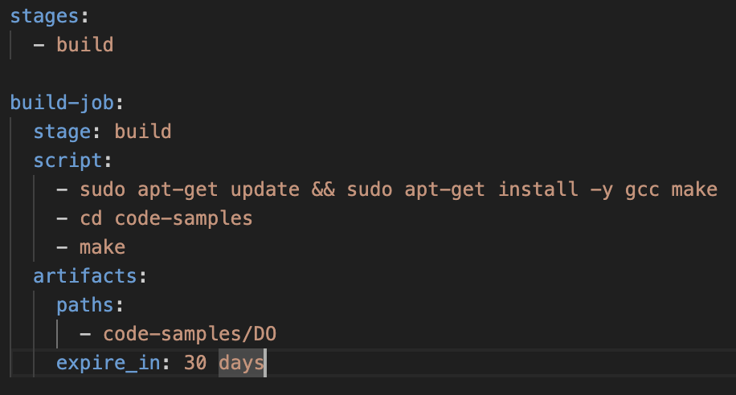
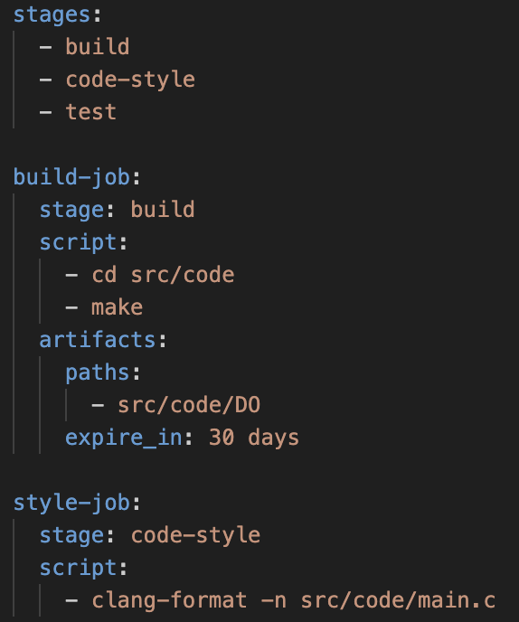
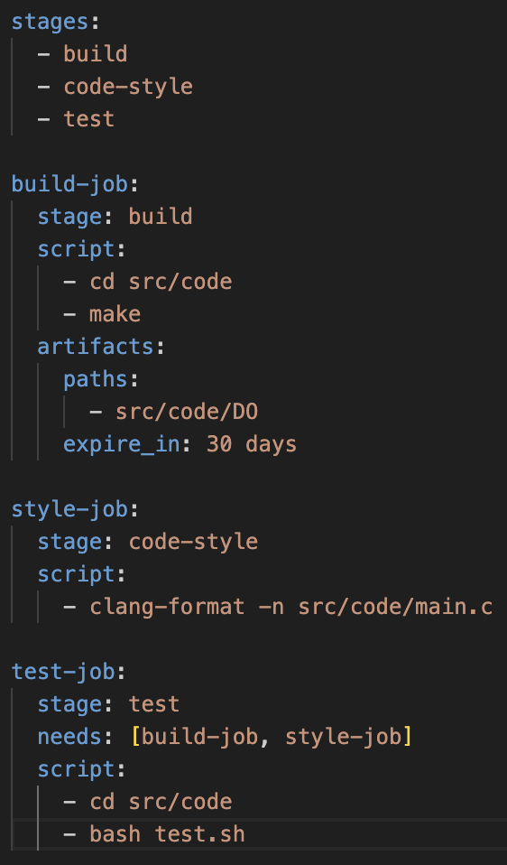
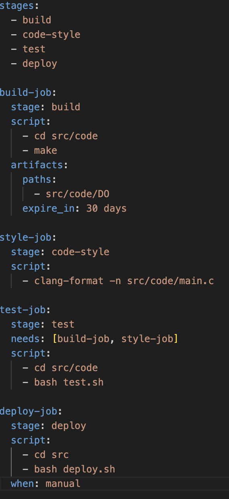
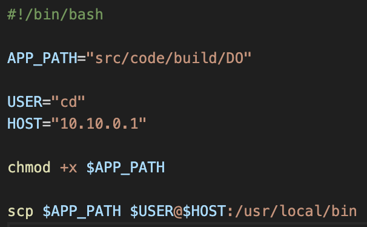
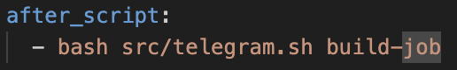
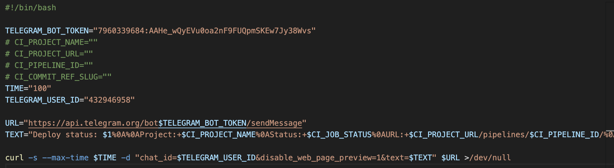

# DO6 Basic CI/CD

## Part 1. Настройка gitlab-runner

### Подними виртуальную машину Ubuntu Server 22.04 LTS.
Будь готов, что в конце проекта нужно будет сохранить дамп образа виртуальной машины.

### Скачай и установи на виртуальную машину gitlab-runner.

### Запусти gitlab-runner и зарегистрируй его для использования в текущем проекте (DO6_CICD).

- Для регистрации понадобятся URL и токен, которые можно получить на страничке задания на платформе.

## Part 2. Сборка

### Напиши этап для CI по сборке приложения из папки code-samples DO.
### В файле gitlab-ci.yml добавь этап запуска сборки через мейк файл из папки code-samples.
### Файлы, полученные после сборки (артефакты), сохрани в произвольную директорию со сроком хранения 30 дней.

## Part 3. Тест кодстайла

### Напиши этап для CI, который запускает скрипт кодстайла (clang-format).
### Если кодстайл не прошел, то «зафейли» пайплайн.
### В пайплайне отобрази вывод утилиты clang-format.

## Part 4. Интеграционные тесты

### Напиши этап для CI, который запустит интеграционные тесты.

Для проекта из папки code-samples напиши интеграционные тесты самостоятельно. Тесты могут быть написаны на любом языке (c, bash, python и т.д.) и должны вызывать собранное приложение для проверки его работоспособности на разных случаях.

### Запусти этот этап автоматически только при условии, если сборка и тест кодстайла прошли успешно.

### Если тесты не прошли, то «зафейли» пайплайн.

### В пайплайне отобрази вывод, что интеграционные тесты успешно прошли / провалились.

## Part 5. Этап деплоя

### Подними вторую виртуальную машину Ubuntu Server 22.04 LTS.

### Напиши этап для CD, который «разворачивает» проект на другой виртуальной машине. Запусти этот этап вручную при условии, что все предыдущие этапы прошли успешно. Добавь этап запуска написанного скрипта.

### Напиши bash-скрипт, который при помощи ssh и scp копирует файлы, полученные после сборки (артефакты), в директорию /usr/local/bin второй виртуальной машины.
*Тут тебе могут помочь знания, полученные в проекте DO2_LinuxNetwork.*

- Будь готов объяснить по скрипту, как происходит перенос.

### на обеих машинах настроил сеть: на ci 10.10.0.2, на cd 10.10.0.1. второй машине выдал права `sudo chmod 777 usr/local/bin`

### `sudo su gitlab-runner`, `ssh-keygen`, `ssh-copy-id cd@10.10.0.1`

### на второй машине видно, что появился ключ

### успешный пайплайн включая ручной этап деплоя

### В случае ошибки «зафейли» пайплайн.

В результате ты должен получить готовое к работе приложения из проекта *C2_SimpleBashUtils (cat и grep)* или приложение из папки *code-samples (DO)* на второй виртуальной машине (в зависимости от того, что ты выполнял).

### успешный успех

## Part 6. Дополнительно. Уведомления

### Настрой уведомления об успешном/неуспешном выполнении пайплайна через бота с именем «[твой nickname] DO6 CI/CD» в *Telegram*.

- Текст уведомления должен содержать информацию об успешности прохождения как этапа CI, так и этапа CD.
- В остальном текст уведомления может быть произвольным.

### создал бота с помощью @BotFather. получил user id с помощью @getmyid_bot 

### добавил в конце каждой стадии выполнение скрипта телеграма

### сам скрипт

### успешный успех2

