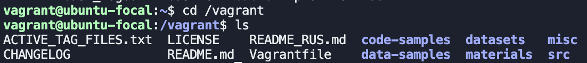
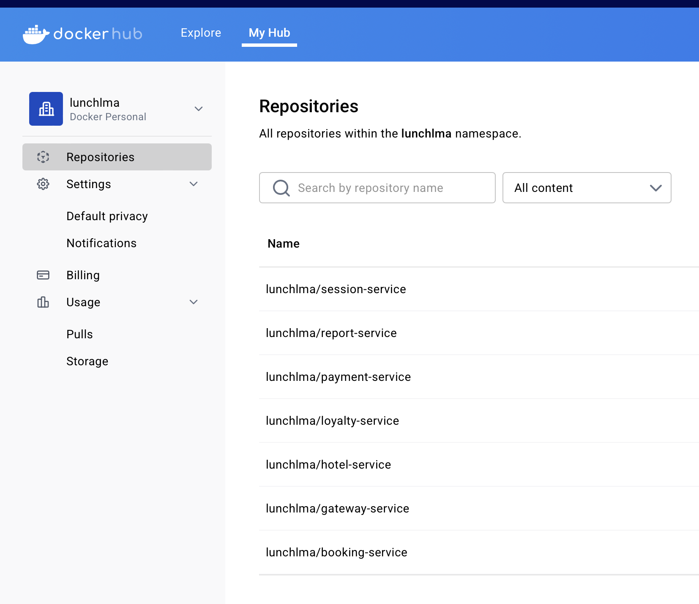
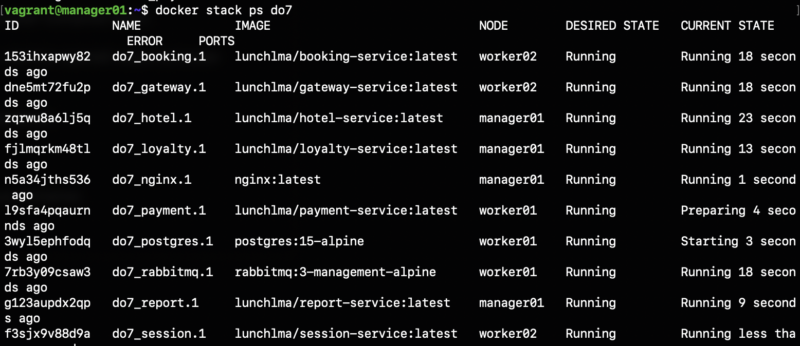
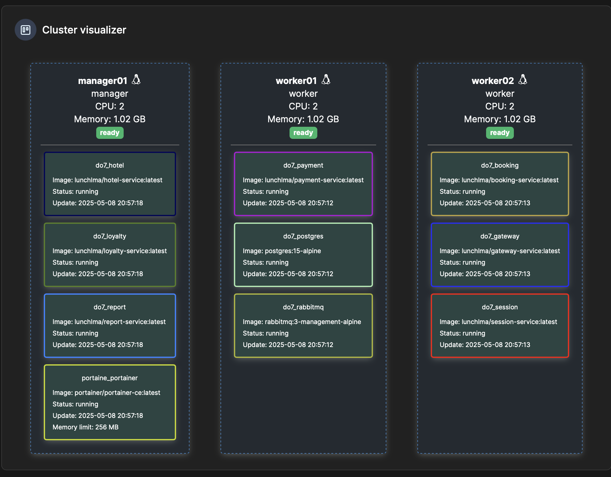

## DevOps Project 7

### Part 1. Запуск нескольких docker-контейнеров с использованием docker compose

Попробуем запустить микросервисное приложение из папки `src` таким образом, чтобы тесты постмана проходили успешно.

#### 1. Напиши Dockerfile для каждого отдельного микросервиса. Необходимые зависимости описаны в материалах. В отчете отобрази размер собранных образов любого сервиса различными способами.

Докерфайл для всех сервисов одинаковый: \
```Dockerfile
# Stage 1: Build
FROM openjdk:8-jdk-alpine AS builder

WORKDIR /app

COPY .mvn/ ./.mvn/
COPY mvnw pom.xml ./

# Установка зависимостей
RUN ./mvnw dependency:go-offline

# Копирование исходного кода проекта
COPY src/ ./src

# Запуск проекта
RUN ./mvnw package -DskipTests

# Stage 2: Run
FROM openjdk:8-jdk-alpine

WORKDIR /app

RUN apk add --no-cache bash

# Копирование скопилированного jar и скрипта ожидания БД
COPY --from=builder /app/target/*jar /app/app.jar
COPY wait-for-it.sh ./
RUN chmod +x wait-for-it.sh

CMD ["./wait-for-it.sh", "postgres:5432", "--timeout=30", "--", \
    "java", "-jar", "app.jar"]
```

Вывел размеры образов с помощью `docker images`: \


#### 2. Напиши docker-compose файл, который осуществляет корректное взаимодействие сервисов. Пробрось порты для доступа к gateway service и session service из локальной машины. Помощь по docker compose ты найдешь в материалах.

docker-compose файл: [docker-compose.yml](src/services/docker-compose.yml)

#### 3. Собери и разверни веб-сервис с помощью написанного docker compose файла на локальной машине.

Запущенные контейнеры: \


#### 4. Прогони заготовленные тесты через postman и удостоверься, что все они проходят успешно. Инструкцию по запуску тестов можно найти в материалах. В отчете отобрази результаты тестирования.

Newman тесты `newman run ../application_tests.postman_collection.json`: \


### Part 2. Создание виртуальных машин

Пришло время заготовить основу для будущих узлов кластера. Создадим виртуальную машину.

#### 1. Установи и инициализируй Vagrant в корне проекта. Напиши Vagrantfile для одной виртуальной машины. Перенеси в виртуальную машину исходный код веб-сервиса в рабочую директорию виртуальной машины. Помощь по vagrant ты найдешь в материалах.

`vagrant init`

Vagrantfile:
```Vagrantfile
Vagrant.configure("2") do |config|
  config.vm.box = "ubuntu/focal64"
```

#### 2. Зайди через консоль внутрь виртуальной машины и удостоверься, что исходный код встал, куда нужно. Останови и уничтожь виртуальную машину.

`vagrant up`

`vagrant ssh`



`vagrant halt`

`vagrant destroy`

### Part 3. Создание простейшего docker swarm

#### 1. Модифицируй Vagrantfile для создания трех машин: manager01, worker01, worker02. Напиши shell-скрипты для установки docker внутрь машин, инициализации и подключения к docker swarm.

Vagrantfile:
```Vagrantfile
Vagrant.configure("2") do |config|
  # Общие настройки для всех машин
  config.vm.box = "ubuntu/focal64"

  # Настройка manager01 (менеджер Swarm)
  config.vm.define "manager01" do |manager|
    manager.vm.hostname = "manager01"
    manager.vm.network "private_network", ip: "192.168.56.10"
    manager.vm.network "forwarded_port", guest: 8087, host: 8087, id: "gateway"
    manager.vm.network "forwarded_port", guest: 8081, host: 8081, id: "session"
    manager.vm.provision "shell", path: "install-docker.sh"
    manager.vm.provision "shell", path: "init-swarm.sh"
  end

  # Настройка worker01 (воркер Swarm)
  config.vm.define "worker01" do |worker|
    worker.vm.hostname = "worker01"
    worker.vm.network "private_network", ip: "192.168.56.11"
    worker.vm.provision "shell", path: "install-docker.sh"
    worker.vm.provision "shell", path: "join-swarm.sh"
  end

  # Настройка worker02 (воркер Swarm)
  config.vm.define "worker02" do |worker|
    worker.vm.hostname = "worker02"
    worker.vm.network "private_network", ip: "192.168.56.12"
    worker.vm.provision "shell", path: "install-docker.sh"
    worker.vm.provision "shell", path: "join-swarm.sh"
  end
end
```

install-docker.sh:
```bash
# Устанавливаем Docker из официального репозитория Ubuntu
sudo apt-get update
sudo apt-get install -y docker.io

# Добавляем текущего пользователя в группу docker (чтобы не использовать sudo)
sudo usermod -aG docker vagrant

# Включаем и запускаем Docker
sudo systemctl enable docker
sudo systemctl start docker

```

init-swarm.sh:
```bash
# Инициализируем Swarm (если ещё не инициализирован)
if [ ! "$(docker info | grep Swarm | sed 's/Swarm: //g')" = "active" ]; then
    docker swarm init --advertise-addr 192.168.56.10
fi

# Сохраняем токен для воркеров в файл (чтобы worker01 и worker02 могли подключиться)
docker swarm join-token worker -q >/vagrant/swarm-token
```

join-swarm.sh:
```bash
# Ждём, пока manager01 создаст токен
while [ ! -f /vagrant/swarm-token ]; do
    echo "Ожидание swarm-token..."
    sleep 5
done

# Получаем токен из файла
SWARM_TOKEN=$(cat /vagrant/swarm-token)

# Подключаемся к Swarm (если ещё не подключены)
if [ ! "$(docker info | grep Swarm | sed 's/Swarm: //g')" = "active" ]; then
    docker swarm join --token $SWARM_TOKEN 192.168.56.10:2377
fi

```

#### 2. Загрузи собранные образы на docker hub и модифицировать docker-compose файл для подгрузки расположенных на docker hub образов.

`docker built -t lunchlma:<name>-service .`
`docker push lunchlma:<name>-service`

Образы в Dockerhub: \


Изменения в *docker-compose.yml*:
```yml
...
postgres:
  volumes:
    - /vagrant/src/services/database:/docker-entrypoint-initdb.d
  deploy:
      restart_policy:
        condition: on-failure
        delay: 5s
        max_attempts: 3
        window: 120s
...
session:
  build: lunchlma:session-service
  networks:
    - app
...
```

#### 3. Подними виртуальные машины и перенести на менеджер docker-compose файл. Запусти стек сервисов, используя написанный docker-compose файл.

`vagrant up` \
`vagrant ssh manager01` \
`sudo docker stack deploy -c /vagrant/docker-compose.yml do7` 


#### 4. Настрой прокси на базе nginx для доступа к gateway service и session service по оверлейной сети. Сами gateway service и session service сделай недоступными напрямую.

```nginx
server {
    listen 8087;
    location / {
        proxy_pass http://gateway:8087;
        proxy_set_header X-Real-IP $remote_addr;
    }
}
server {
    listen 8081;
    location / {
        proxy_pass http://session:8081; 
        proxy_set_header X-Real-IP $remote_addr;

    }
}
```

docker-compose файл: [docker-compose.yml](docker-compose.yml)

#### 5. Прогони заготовленные тесты через postman и удостоверься, что все они проходят успешно. В отчете отобрази результаты тестирования.

Postman тесты проходят успешно: \


#### 6. Используя команды docker, отобрази в отчете распределение контейнеров по узлам.

`docker stack ps do7` \


Как видно, сервисы равномерно распределись по всем нодам.

#### 7. Установи отдельным стеком Portainer внутри кластера. В отчете отобрази визуализацию распределения задач по узлам с помощью Portainer.

Vagrantfile:
```Vagrantfile
...
manager.vm.network "forwarded_port", guest: 9000, host: 9000, id: "portainer"
...
```

portainer.yml:
```yml
services:
  portainer:
    image: portainer/portainer-ce:latest
    command: -H unix:///var/run/docker.sock
    volumes:
      - /var/run/docker.sock:/var/run/docker.sock
      - portainer_data:/data
    ports:
      - "9000:9000"
    deploy:
      mode: replicated
      replicas: 1
      placement:
        constraints:
          - "node.role==manager"
      resources:
        limits:
          memory: 256M

volumes:
  portainer_data:
    external: true
```

`sudo docker stack deploy -c /vagrant/src/portainer.yml portainer`


