# DevOps 8

## Part 1. Удаленное конфигурирование узла через Ansible

В этой главе тебе предстоит осуществить удаленную настройку узла для разворачивания мультисервисного приложения.

**== Задание ==**

1) Создать с помощью Vagrant три машины - manager (192.168.56.10), node01 (192.168.56.11), node02 (192.168.56.12). Не устанавливать с помощью shell-скриптов docker при создании машин на Vagrant! Прокинуть порты node01 на локальную машину для доступа к пока еще не развернутому микросервисному приложению.

Vagrantfile:
```Vagrantfile
Vagrant.configure("2") do |config|
  # Общие настройки для всех машин
  config.vm.box = "ubuntu/focal64"

  # Настройка manager (менеджер Swarm)
  config.vm.define "manager" do |manager|
    manager.vm.hostname = "manager"
    manager.vm.network "private_network", ip: "192.168.56.10"
    manager.vm.provision "shell", inline: <<-SHELL
      sudo apt-get update && sudo apt-get install -y ansible
    SHELL
  end

  # Настройка node01 (воркер Swarm)
  config.vm.define "node01" do |worker|
    worker.vm.hostname = "node01"
    worker.vm.network "private_network", ip: "192.168.56.11"
    worker.vm.network "forwarded_port", guest: 8087, host: 8087, id: "gateway"
    worker.vm.network "forwarded_port", guest: 8081, host: 8081, id: "session"
    worker.vm.provider "virtualbox" do |v|
      v.memory = "4096"
    end
  end

  # Настройка node02 (воркер Swarm)
  config.vm.define "node02" do |worker|
    worker.vm.hostname = "node02"
    worker.vm.network "private_network", ip: "192.168.56.12"
  end
end
```

2) Подготовить manager как рабочую станцию для удаленного конфигурирования (помощь по Ansible в материалах).
- Зайти на node01 (повторить для node02). \
`vagrant ssh node01`
`sudo nano /etc/ssh/sshd_config` \
PasswordAuthentication no -> yes \
`sudo service sshd restart`
- На manager проверить подключение к node01 через ssh по приватной сети. \
`vagrant ssh manager`
`ssh vagrant@192.168.56.11`
- Сгенерировать ssh-ключ для подключения к node01 из manager (без passphrase). \
`ssh-keygen -C pt3` \
`ssh-copy-id -i /home/vagrant/.ssh/id_rsa.pub 192.168.56.11`
- Скопировать на manager [docker-compose файл](src/services/docker-compose.yml) и исходный код микросервисов. (Проект из папки src и docker-compose файл из DevOps 7.)
- Создать папку ansible, в которой создать inventory-файл. \
`sudo apt-get update && sudo apt-get install -y ansible` \
`nano /ansible/inventory.ini`
```ini
[manager]
192.168.56.10 ansible_connection=local

[nodes]
node01 ansible_host=192.168.56.11 
node02 ansible_host=192.168.56.12
```
- Использовать модуль ping для проверки подключения через Ansible. \
`ansible -i inventory.ini nodes -m ping`:
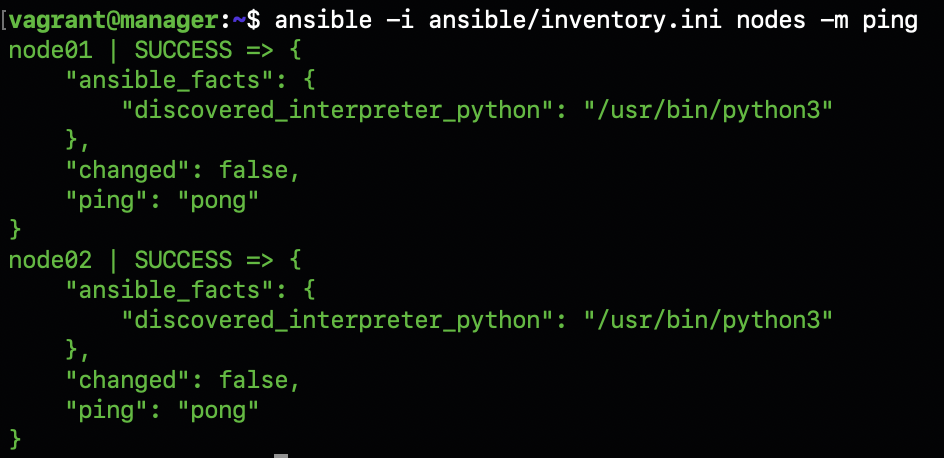

3) Написать первый плейбук для Ansible, который выполняет apt update, устанавливает docker, docker-compose, копирует compose-файл из manager'а и разворачивает микросервисное приложение.

```yml
---
- hosts: node01
  become: true # Выполнение с sudo
  tasks:
  - name: apt update
    ansible.builtin.apt:
      update_cache: true

  - name: install dependencies
    ansible.builtin.apt:
      name:
        - ca-certificates
        - curl
        - gnupg
        - lsb-release
      state: present

  - name: add GPG key
    ansible.builtin.apt_key:
      url: "https://download.docker.com/linux/ubuntu/gpg"
      state: present

  - name: add docker repository to apt
    ansible.builtin.apt_repository:
      repo: "deb [arch=amd64] https://download.docker.com/linux/ubuntu {{ ansible_distribution_release }} stable"
      state: present

  - name: install docker
    ansible.builtin.apt:
      name:
        - docker-ce
        - docker-ce-cli
        - containerd.io
      state: present

  - name: check docker is active
    service:
      name: docker
      state: started
      enabled: yes

  - name: ensure group "docker" exists
    ansible.builtin.group:
      name: docker
      state: present

  - name: add vagrant user to docker group
    user:
      name: vagrant
      groups: docker
      append: yes

  - name: install docker-compose
    ansible.builtin.get_url:
      url: "https://github.com/docker/compose/releases/download/v2.23.0/docker-compose-linux-x86_64"
      dest: "/usr/local/bin/docker-compose"
      mode: "0755" # exec

  - name: change file ownership, group and permissions
    ansible.builtin.file:
      path: /usr/local/bin/docker-compose
      owner: vagrant
      group: vagrant 

  - name: deploy application
    command: docker-compose up -d
    args:
      chdir: /vagrant/services
```

`ansible-playbook -i inventory.ini playbook.yml`

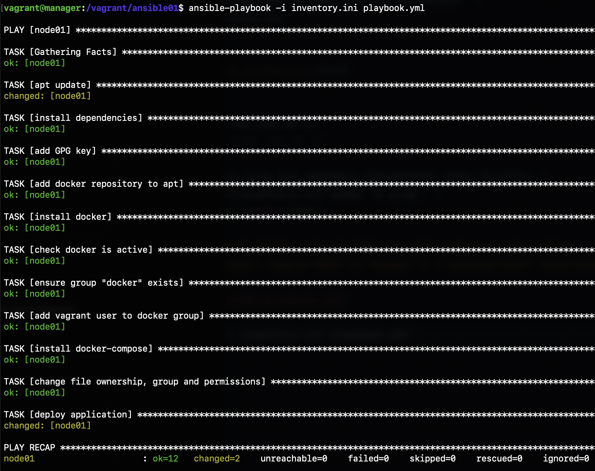

4) Прогнать [заготовленные тесты](src/application_tests.postman_collection.json) через postman и удостовериться, что все они проходят успешно.

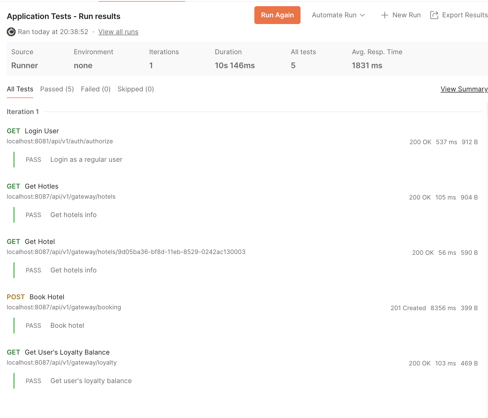

5) Сформировать три роли:

- [application](src/ansible01/application/tasks/main.yml) выполняет развертывание микросервисного приложения при помощи docker-compose.
- [apache](src/ansible01/apache/tasks/main.yml) устанавливает и запускает стандартный apache сервер.
apache/tasks/main.yml:
```yml
---
- name: install apache2
  become: true
  ansible.builtin.apt:
    name: apache2
    update_cache: yes
    state: latest

- name: Start Apache service
  become: true
  service:
    name: apache2
    state: started
  
- name: Create a simple HTML page
  become: true
  copy:
    content: "<h1>Apache on node02 is running!</h1>"
    dest: /var/www/html/index.html
```
- [postgres](src/ansible01/postgres/tasks/main.yml) устанавливает и запускает postgres, создает базу данных с произвольной таблицей и добавляет в нее три произвольные записи.
* Для использования community модуля нужно вызвать команду на manager: \
`ansible-galaxy collection install community.postgresql` \
postgres/tasks/main.yml:
```yml
---
- name: install PostgreSQL via apt
  become: true
  apt:
    name: 
      - postgresql
      - python3-psycopg2
    state: present
    update_cache: yes

- name: start and enable PostgreSQL
  become: true
  service:
    name: postgresql
    state: started
    enabled: yes

- name: Set password for postgres user
  become: true
  shell: sudo -u postgres psql -c "ALTER USER postgres WITH PASSWORD 'postgres';"

- name: create database
  community.postgresql.postgresql_db:
    name: test_db
    state: present
    login_user: postgres
    login_password: "postgres"
    login_host: localhost

- name: copy init script
  become: true
  copy:
    src: init.sql
    dest: /tmp/init.sql
    mode: '0644'

- name: init database
  community.postgresql.postgresql_script:
    login_db: test_db
    login_user: postgres
    login_password: "postgres"
    login_host: localhost
    path: /tmp/init.sql
```
скрипт для БД init.sql:
```sql
CREATE TABLE IF NOT EXISTS test_db (
    id SERIAL PRIMARY KEY,
    name VARCHAR(100),
    value INTEGER
);

INSERT INTO test_db (name, value) VALUES
    ('Item 1', 100),
    ('Item 2', 200),
    ('Item 3', 300);
```
- Назначить первую роль node01 и вторые две роли node02, проверить postman-тестами работоспособность микросервисного приложения, удостовериться в доступности postgres и apache-сервера. Для Apache веб-страница должна открыться в браузере. Что касается PostgreSQL, необходимо подключиться с локальной машины и отобразить содержимое ранее созданной таблицы с данными.
Основной playbook:
```yml
---   
- name: deploy apllication 
  hosts: node01
  become: true # Выполнение с sudo
  roles:
    - application

- name: setup Apache & PostgreSQL
  hosts: node02
  roles:
    - apache
    - postgres
```

Пинг между машинами проходит успешно: \
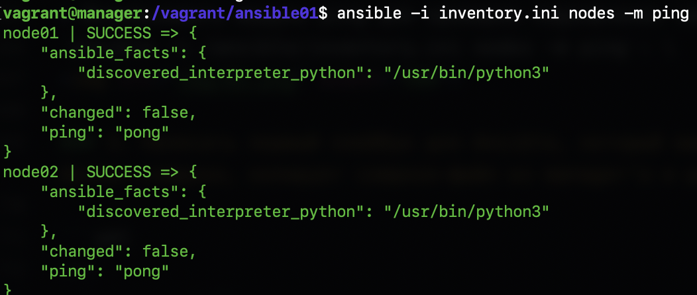

Playbook успешно выполняет работу: \
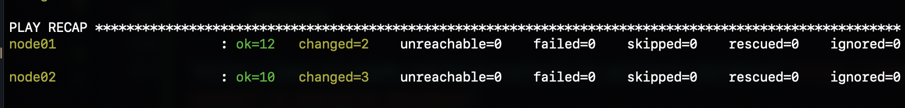

Для удаленного подключения psql к node02 (192.168.56.12) нужно на node02 настроить: \
[https://www.strongdm.com/blog/connect-to-postgres-database](https://www.strongdm.com/blog/connect-to-postgres-database) \
`$ sudo nano /etc/postgresql/12/main/postgresql.conf` \
listen_addresses='192.168.56.12' \
`$ sudo systemctl restart postgresql` \
`$ sudo nano /etc/postgresql/12/main/pg_hba.conf` \
host all    all     0.0.0.0/0     md5 \

Сервер apache отображается в браузере: \
 \

Удаленный запрос psql с локальной машины: \
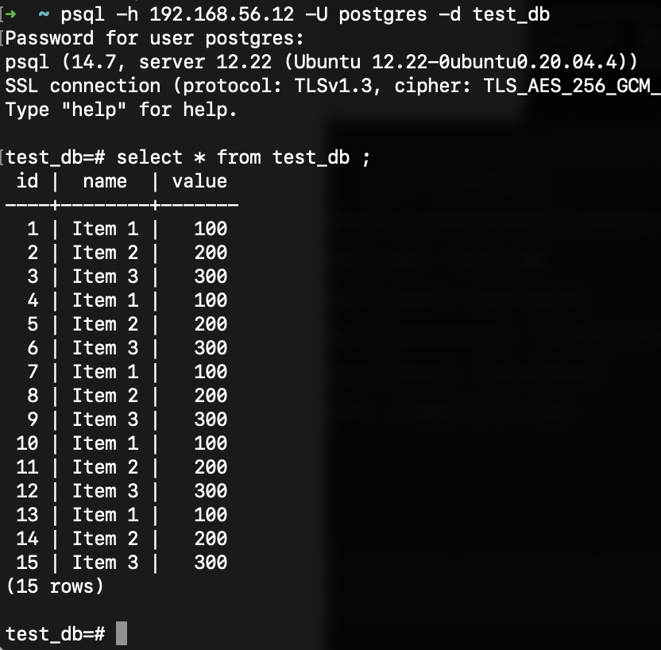

6) Созданные в этом разделе файлы разместить в папке [src\ansible01](src/ansible01) в репозитории.

## Part 2. Service Discovery

Теперь перейдем к обнаружению сервисов. В этой главе тебе предстоит cымитировать два удаленных сервиса - api и БД, и осуществить между ними подключение через Service Discovery с использованием Consul.

**== Задание ==**

1) Написать два конфигурационный файла для consul:
- [consul_server.hcl](src/consul01/consul_server.hcl):
  - настроить агент как сервер;
  - указать в advertise_addr интерфейс, направленный во внутреннюю сеть Vagrant
```hcl
server = true
bootstrap_expect = 1
data_dir = "/opt/consul"
bind_addr = "192.168.56.10"
advertise_addr = "192.168.56.10"
client_addr = "0.0.0.0"

ui = true

connect {
	enabled = true
}

ports {
  grpc  = 8502
}
```
- [consul_client.hcl.j2](src/consul01/consul_client.hcl.j2):
  - настроить агент как клиент;
  - указать в advertise_addr интерфейс, направленный во внутреннюю сеть Vagrant
```hcl
server = false
data_dir = "/opt/consul"
bind_addr = "{{ consul_ip }}"
advertise_addr = "{{ consul_ip }}"
client_addr = "0.0.0.0"
retry_join = ["192.168.56.10"]

ports {
    grpc = 8502
}
connect {
    enabled = true
}
```
*.j2* (jinja2 templates) позволяет динамически вставлять переменные а конфигурационные фалйы. *consul_ip* берётся из inventory файла и для *db* и *api* машин будут подставляться свои ip адреса.

2) Создать с помощью [Vagrant](src/Vagrantfile) четыре машины - consul_server, api, manager и db.
- Прокинуть порт 8082 с api на локальную машину для доступа к пока еще не развернутому api
- Прокинуть порт 8500 с manager для доступа к ui consul.
```Vagrantfile
Vagrant.configure("2") do |config|
  config.vm.box = "ubuntu/focal64"

  config.vm.provision "shell", inline: <<-SHELL
    sudo sed -i 's/PasswordAuthentication no/PasswordAuthentication yes/g' /etc/ssh/sshd_config
    sudo systemctl restart sshd
  SHELL

  config.vm.define "consul" do |consul|
    consul.vm.hostname = "consul"
    consul.vm.network "private_network", ip: "192.168.56.10"
    consul.vm.network "forwarded_port", guest: 8500, host: 8500, id: "consul_ui"
  end

  config.vm.define "api" do |api|
    api.vm.hostname = "api"
    api.vm.network "private_network", ip: "192.168.56.11"
    api.vm.network "forwarded_port", guest: 8082, host: 8082, id: "app"
    api.vm.provider "virtualbox" do |v| # for docker-compose better performance
      v.memory = "4096"
    end
  end

  config.vm.define "manager" do |manager|
    manager.vm.hostname = "manager"
    manager.vm.network "private_network", ip: "192.168.56.12"
    manager.vm.provision "shell", inline: <<-SHELL
      sudo apt-get update && sudo apt-get install -y ansible
      SHELL
  end

  config.vm.define "db" do |db|
    db.vm.hostname = "db"
    db.vm.network "private_network", ip: "192.168.56.13"
  end
end
```

3) Написать [плейбук](src/ansible02/playbook.yml) для ansible и четыре роли:
- [install_consul_server](src/ansible02/roles/install_consul_server/tasks/main.yml), которая:
  - работает с consul_server;
  - копирует consul_server.hcl;
  - устанавливает consul и необходимые для consul зависимости;
  - запускает сервис consul;
```yml
---
- name: install dependencies
  apt:
    name:
      - unzip
      - curl
    state: present
    update_cache: yes

# - name: download Consul
#   get_url:
#     url: https://github.com/hashicorp/consul/archive/refs/tags/v1.21.1.zip
#     dest: /tmp/consul.zip

# - name: unzip Consul
#   unarchive:
#     src: /tmp/consul.zip
#     dest: /usr/local/bin/
#     remote_src: yes
#     creates: /usr/local/bin/consul

- name: Create Consul directories
  file:
    path: "{{ item }}"
    state: directory
    mode: 0755
  loop:
    - /opt/consul
    - /opt/consul/data
    - /etc/consul.d

- name: Unzip Consul
  unarchive:
    # src: /tmp/consul.zip
    src: /vagrant/consul01/consul_1.21.2_linux_amd64.zip
    dest: /usr/local/bin/
    remote_src: yes
    mode: "0755"

- name: copy consul_server.hcl
  copy:
    src: /vagrant/consul01/consul_server.hcl
    dest: /etc/consul.d/consul.hcl

- name: сreate systemd service for Consul
  copy:
    dest: /etc/systemd/system/consul.service
    content: |
      [Unit]
      Description=Consul Agent
      After=network.target

      [Service]
      ExecStart=/usr/local/bin/consul agent -config-dir=/etc/consul.d
      Restart=on-failure
      LimitNOFILE=65536

      [Install]
      WantedBy=multi-user.target
    mode: "0644"

- name: reload systemd
  command: systemctl daemon-reload

- name: enable Consul
  service:
    name: consul
    enabled: yes
    state: started
```
- [install_consul_client](src/ansible02/roles/install_consul_client/tasks/main.yml), которая:
  - работает с api и db;
  - копирует consul_client.hcl;
  - устанавливает consul, envoy и необходимые для consul зависимости;
  - запускает сервис consul и consul-envoy;
```yml
---
- name: install dependencies
  apt:
    name:
      - unzip
      - curl
    state: present
    update_cache: yes

- name: Create Consul directories
  file:
    path: "{{ item }}"
    state: directory
    mode: 0755
  loop:
    - /opt/consul
    - /opt/consul/data
    - /etc/consul.d

# - name: Download Consul binary
#   get_url:
#     url: https://releases.hashicorp.com/consul/1.21.2/consul_1.21.2_linux_amd64.zip
#     dest: /tmp/consul.zip

- name: Unzip Consul
  unarchive:
    # src: /tmp/consul.zip
    src: /vagrant/consul01/consul_1.21.2_linux_amd64.zip
    dest: /usr/local/bin/
    remote_src: yes
    mode: "0755"

- name: download Envoy binary from GitHub
  get_url:
    url: https://github.com/envoyproxy/envoy/releases/download/v1.34.1/envoy-1.34.1-linux-x86_64
    dest: /usr/local/bin/envoy
    mode: "0755"

- name: copy consul_client.hcl
  template:
    src: /vagrant/consul01/consul_client.hcl.j2
    dest: /etc/consul.d/consul.hcl
    force: true

- name: set service_name for Consul Envoy Sidecar
  set_fact:
    service_name: "{{ 'postgres' if ansible_hostname == 'db' else 'hotel-service' }}"

- name: copy hotel service definition for Consul
  copy:
    src: "/vagrant/consul01/hotel-service.json"
    dest: "/etc/consul.d/hotel-service.json"
  when: ansible_hostname == "api"

- name: copy postgres service definition for Consul
  copy:
    src: "/vagrant/consul01/postgres.json"
    dest: "/etc/consul.d/postgres.json"
  when: ansible_hostname == "db"

- name: сreate systemd service for Consul
  copy:
    dest: /etc/systemd/system/consul.service
    content: |
      [Unit]
      Description=Consul Agent
      After=network.target

      [Service]
      ExecStart=/usr/local/bin/consul agent -config-dir=/etc/consul.d
      Restart=on-failure
      LimitNOFILE=65536

      [Install]
      WantedBy=multi-user.target
    mode: "0644"

- name: create systemd service for Envoy
  copy:
    dest: /etc/systemd/system/envoy.service
    content: |
      [Unit]
      Description=Consul Envoy Sidecar
      Requires=consul.service
      After=network.target consul.service

      [Service]
      ExecStart=/usr/local/bin/consul connect envoy -sidecar-for {{ service_name }} -ignore-envoy-compatibility
      Restart=on-failure
      LimitNOFILE=65536

      [Install]
      WantedBy=multi-user.target
    mode: "0644"

- name: reload systemd
  command: systemctl daemon-reload

- name: enable Consul
  systemd:
    name: consul
    enabled: yes
    state: started

- name: enable Envoy
  systemd:
    name: envoy
    enabled: yes
    state: started
```
- [install_db](src/ansible02/roles/install_db/tasks/main.yml), которая:
  - работает с db;
  - устанавливает postgres и запускает его;
  - создает базу данных hotels_db;
```yml
---
- name: install PostgreSQL
  apt:
    name:
      - postgresql
      - python3-psycopg2
    state: present
    update_cache: yes

- name: start and enable PostgreSQL
  service:
    name: postgresql
    state: started
    enabled: yes
- name: Set password for postgres user
  shell: sudo -u postgres psql -c "ALTER USER postgres WITH PASSWORD 'postgres'"

- name: create hotels_db
  command: sudo -iu postgres psql postgres -c "CREATE DATABASE hotels_db"
```
- [install_hotels_service](src/ansible02/roles/install_hotel_service/tasks/main.yml), которая:
  - работает с api;
  - копирует исходный код сервиса
  - устанавлвиает openjdk-8-jdk
  - создает глобальные переменные окружения:
    - POSTGRES_HOST="127.0.0.1"
    - POSTGRES_PORT="5432"
    - POSTGRES_DB="hotels_db"
    - POSTGRES_USER="<имя пользователя>"
    - POSTGRES_PASSWORD="<пароль пользователя>"
  - запускает собранный jar-файл командой java -jar <путь до hotel-service>/hotel-service/target/<имя jar-файла>.jar
```yml
---
- name: copy hotel service code
  copy:
    src: /vagrant/services/hotel-service/
    dest: /opt/hotel-service/
    owner: vagrant
    group: vagrant
    mode: "0755"

- name: install openjdk-8-jdk
  apt:
    name:
      - openjdk-8-jdk
    state: present
    update_cache: yes

- name: set environment variables
  lineinfile:
    path: /etc/environment
    line: "{{ item }}"
  loop:
    - "POSTGRES_HOST=127.0.0.1"
    - "POSTGRES_PORT=5432"
    - "POSTGRES_DB=hotels_db"
    - "POSTGRES_USER=postgres"
    - "POSTGRES_PASSWORD=postgres"

- name: source environment variables
  shell: source /etc/environment
  args:
    executable: /bin/bash

- name: download dependencies
  command: ./mvnw dependency:go-offline
  args:
    chdir: /opt/hotel-service

- name: build the hotel service .jar file
  command: ./mvnw package -DskipTests
  args:
    chdir: /opt/hotel-service

- name: hotel-service dir is writable
  file:
    path: /opt/hotel-service
    owner: vagrant
    group: vagrant
    recurse: true

- name: run hotel service
  shell: |
    nohup java -jar target/hotel-service-0.0.1-SNAPSHOT.jar \
      >> hotel-service.log 2>&1 &
    echo $! > hotel-service.pid
  args:
    chdir: /opt/hotel-service
    executable: /bin/bash
```

* playbook.yml:
```yml
---
- name: install Consul server
  hosts: consul
  become: true
  roles:
    - install_consul_server

- name: install Consul clients
  hosts: api:db
  become: true
  roles:
    - install_consul_client

- name: install PostgreSQL on db
  hosts: db
  become: true
  roles:
    - install_db

- name: deploy app
  hosts: api
  become: true
  roles:
    - install_hotels_service
```

Интерфейс Consul (localhost:8500), где видно 3 сервиса, объединенных друг с другом в Service Mesh, что обеспечивает авторизацию и шифрование соединений между сервисами с использованием протокола защиты транспортного уровня (TLS), а "голый" трафик сервисов никогда не покидает конкретный узел.

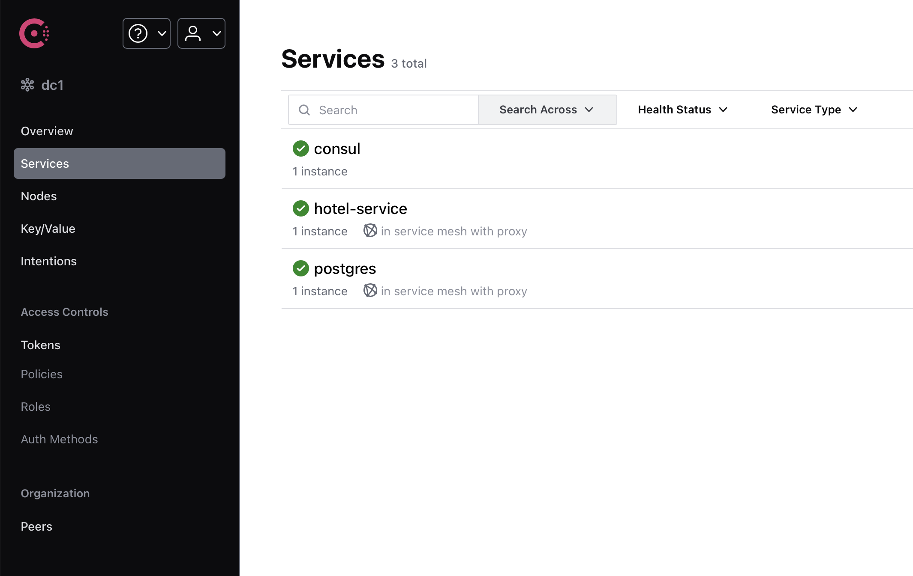

hotel-services/instances. Здесь находятся healthcheck'и, а также видно, что существует прокси Envoy, к которому обращается микросервис.

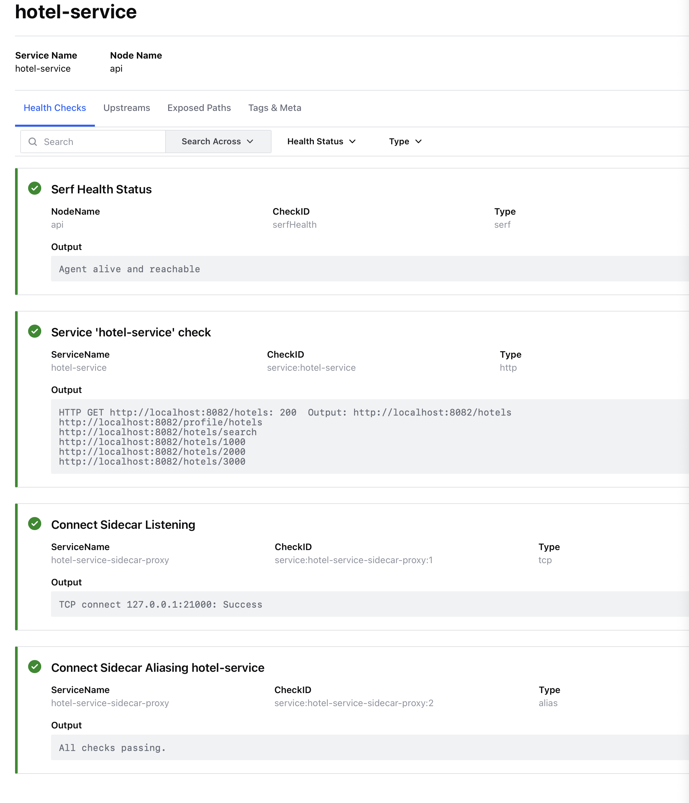

Аналогично для сервиса postgres

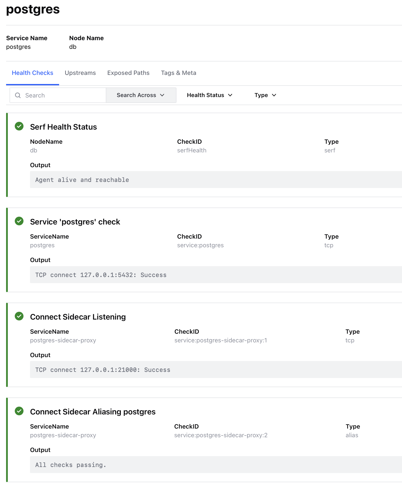

4) Проверить работоспособность CRUD-операций над сервисом отелей. В отчете отобразить результаты тестирования.

POST запрос, добавил новый отель.

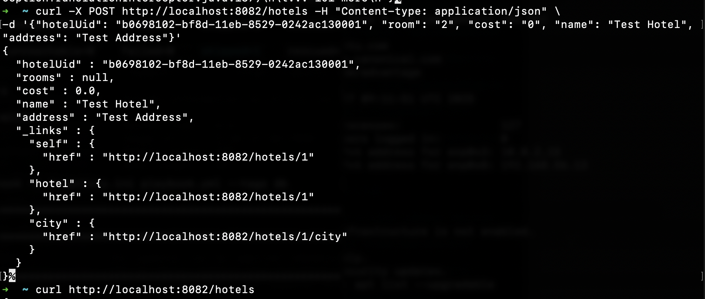

GET запрос, где видно новый добавленный отель.

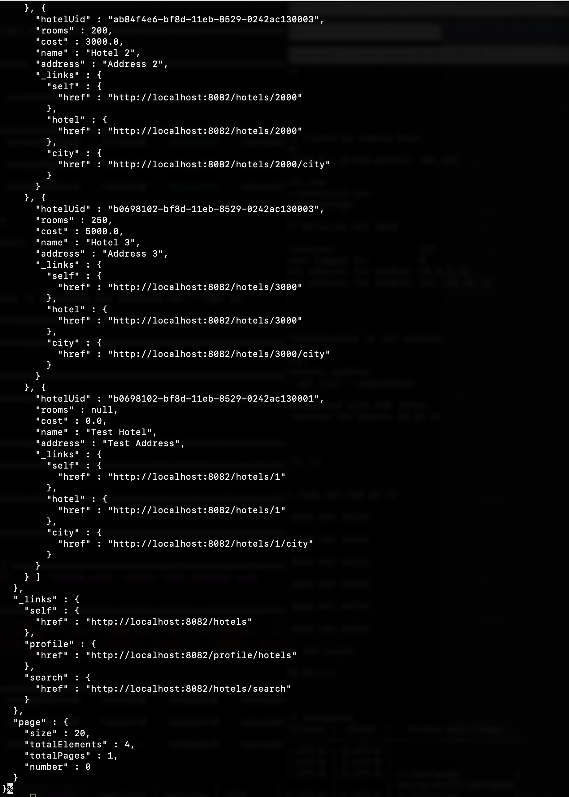

5) Созданные в этом разделе файлы разместить в папках [src\ansible02](src/ansible02) и [src\consul01](src/consul01) в репозитории.